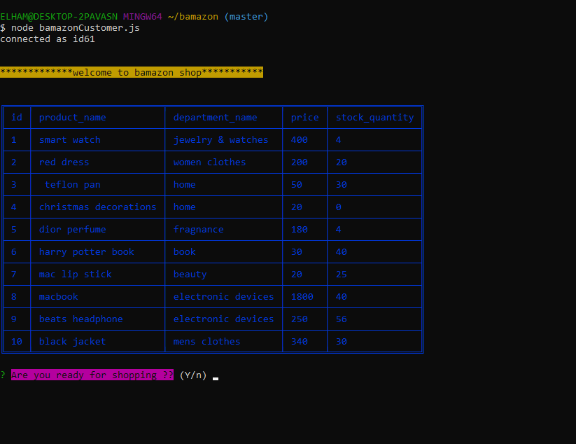
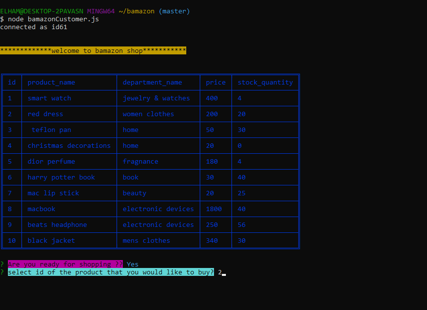
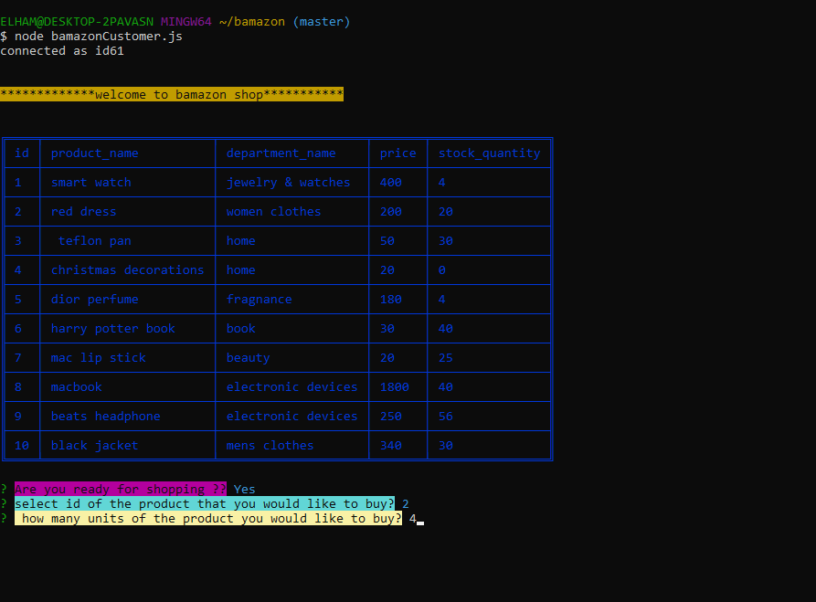
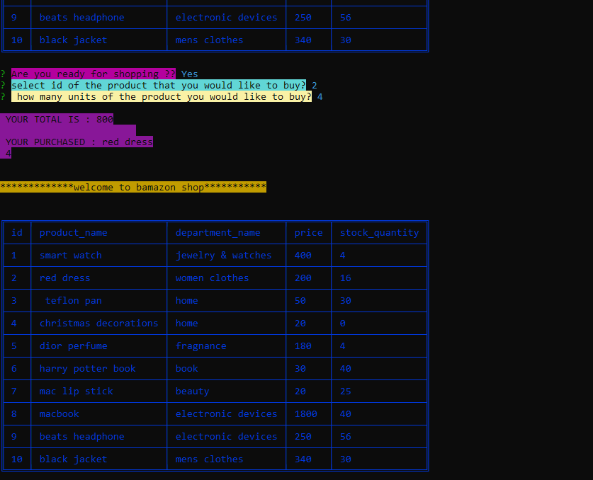
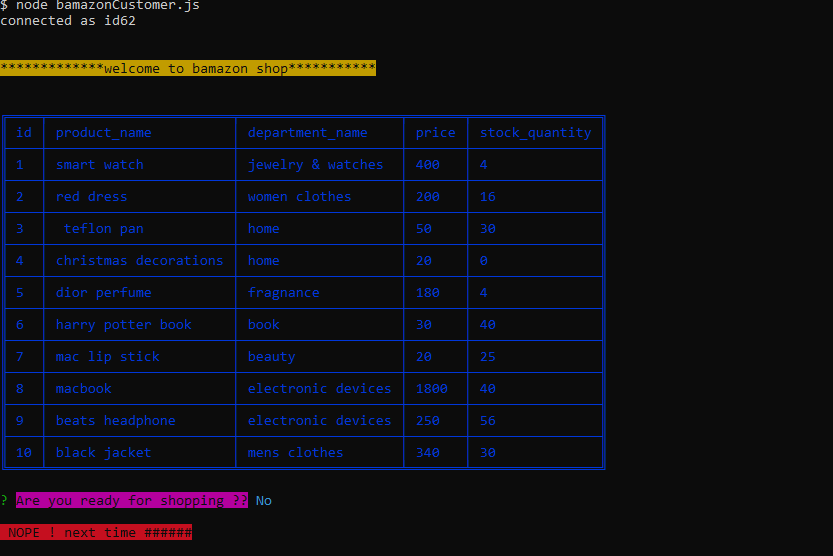

# bamazon

Bamazon is like amazon site that you can purchase any item you want here is small simulation of amazon with some limit items which you can select any of them with id and then it will ask you how many of product you want and at the end you will see your total price and name of product and quantity

## Repository link 
[repository Link](https://elhamposhtiban.github.io/bamazon/) 

## Tech Stack

•	What languages is it written with?  node.js.  
•	the package i used : npm , chalk, , inquirer, my sql

 ##  Previews of App 
  table:    
 
 select product with id:    
 
 quantity:    
 
 total:   
 
exit:   
 
